# Library Management 📚

## Table of Contents
- [Technology](#technology-)
- [Description](#description-)
- [Goal](#goal-)
- [Users](#users)
- [Employee Functions](#employee-functions-)
  - [1. Sign In](#1-sign-in)
  - [2. Create Client](#2-create-client)
  - [3. Display Client Sorted by ID](#3-display-client-sorted-by-id)
  - [4. Create Books](#4-create-books)
  - [5. Display Book Sorted by ID](#5-display-book-sorted-by-id)
  - [6. Rent Book](#6-rent-book)
  - [7. Return Book](#7-return-book)
  - [8. Sell Book](#8-sell-book)
  - [9. Display All Books Rented](#9-display-all-books-rented)
  - [10. Display Books Purchased](#10-display-books-purchased)
  - [11. Sign Out](#11-sign-out)
- [Client Functions](#client-functions-)
  - [1. Sign In](#1-sign-in-1)
  - [2. View Rented Books](#2-view-rented-books)
  - [3. View Purchased Books](#3-view-purchased-books)
- [Contribution](#contribution-)

## Technology 💻
**Technology:** C#, Visual Studio

## Description 📝
**Description:** Library Management System is a C# application built using Visual Studio that helps manage library operations efficiently. It includes functionalities for both employees and clients, using fundamental programming concepts and struct data structures in C#.

## Goal 🎯
**Goal:** This application aims to streamline library management, from client registration and book inventory to rental and sales transactions. It utilizes C# structures for efficient data handling and ensures a smooth user experience for both employees and clients.

## Users
- **Client**
- **Employee**

## Employee Functions 🚀

### 1. Sign In
The employee can sign in with their credentials:
- **ID:** 111111
- **Password:** tester

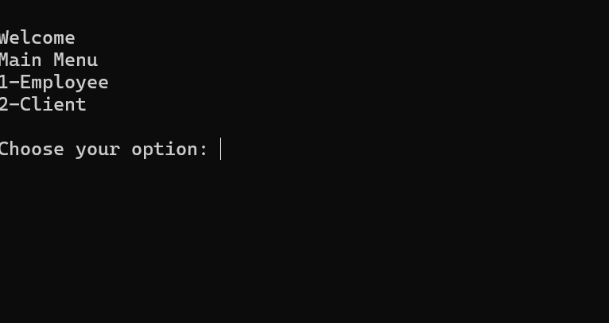

After successful login, the options are shown as above.

### 2. Create Client
Employees can add new clients to the library. If successfully created, a "Client added" message appears. If fields are incorrect, an error message is displayed. Client IDs are auto-generated.

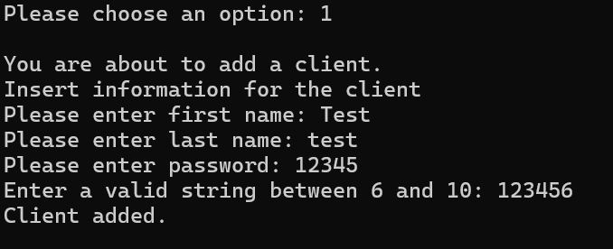

### 3. Display Client Sorted by ID
Displays a list of clients sorted by their ID.

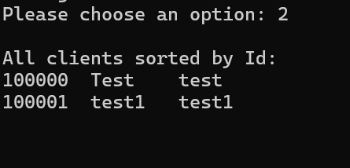

### 4. Create Books
Allows employees to add new books to the library system.

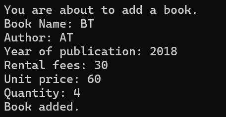

### 5. Display Book Sorted by ID
The newly created book is shown at the bottom of the list.

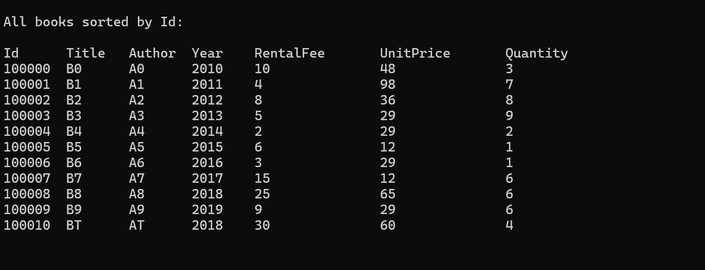

### 6. Rent Book
The employee can rent a book to a client using the client's ID. The client can rent multiple books with their respective book IDs.

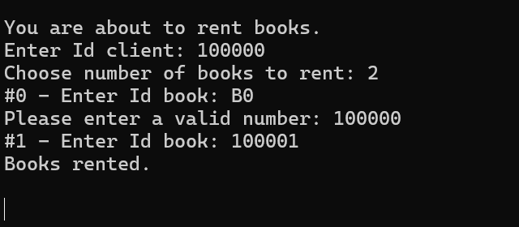

### 7. Return Book
The employee will manage the returned book. They enter the number of days the book was rented to calculate the total amount the client needs to pay.

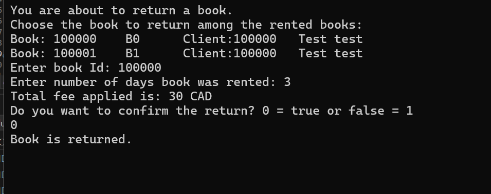

### 8. Sell Book
The employee is able to sell books. After a book is purchased, its quantity decreases in the inventory.

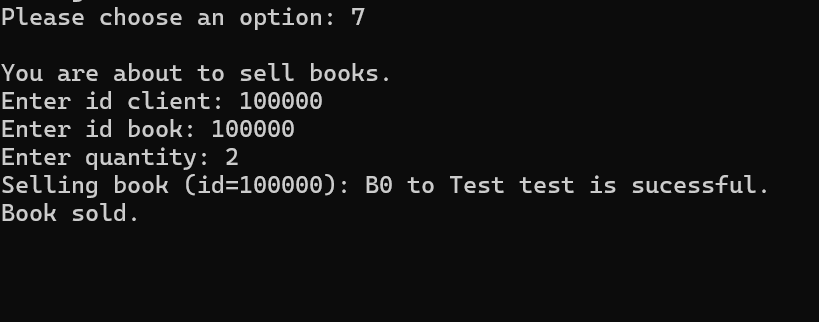
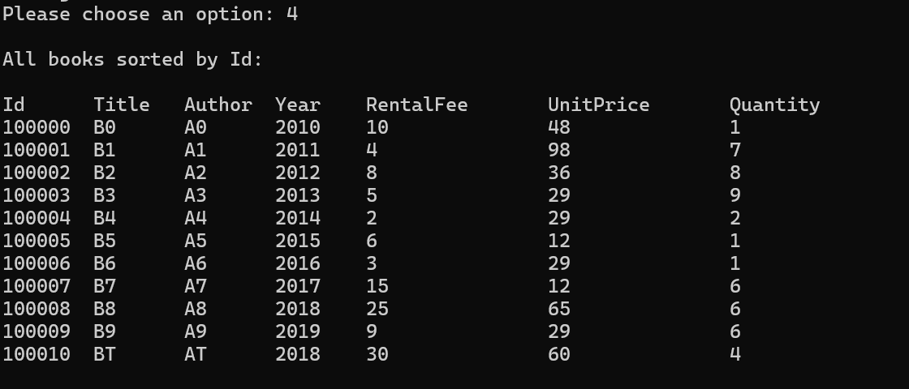

### 9. Display All Books Rented
Displays a list of all books currently rented.

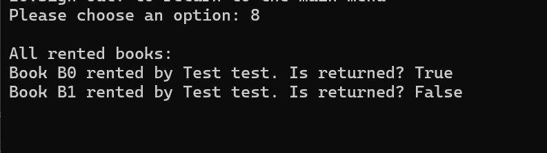

### 10. Display Books Purchased
Displays a list of books that have been purchased.

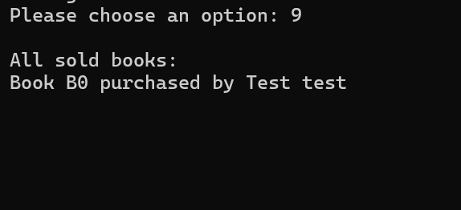

### 11. Sign Out
The employee can sign out and return to the first welcome page.

## Client Functions 🌟

### 1. Sign In
The client can sign in with their credentials.

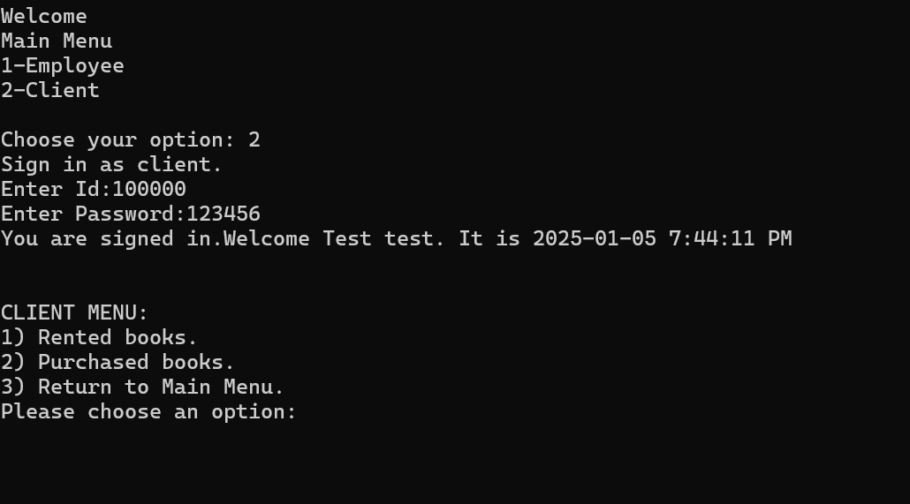

### 2. View Rented Books
The client can view a list of books they have rented.

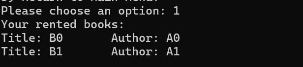

### 3. View Purchased Books
The client can view a list of books they have purchased.

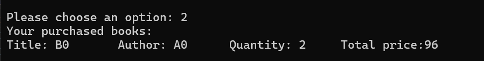

## Contribution ✨
This project was created with **Thiago Padilha de Hollanda Neto**.

---

