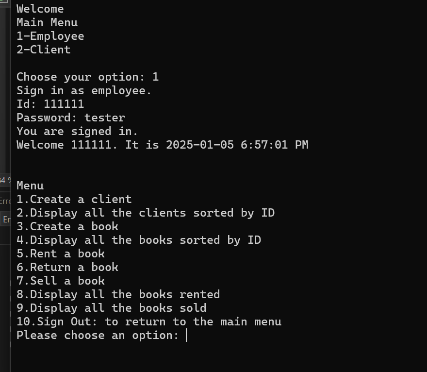

**Library Management :  
**

**Technology:** C# , visual Studio

**Description:** Library Management System is a C# application built
using Visual Studio that helps manage library operations efficiently. It
includes functionalities for both employees and clients, using
fundamental programming concepts and struct data structures in C#.

**Goal:** This application aims to streamline library management, from
client registration and book inventory to rental and sales transactions.
It utilizes C# structures for efficient data handling and ensures a
smooth user experience for both employees and clients

**User:**

Client

Employee

**Functions Employee:**

**1-The employee can sign in with his/her credential:**

Id: 111111

Password = “tester”

After successful login , the options are shown as above

**1-Create client:**

Employees can add new clients to the library. If successfully created, a
"Client added" message appears. If fields are incorrect, an error
message is displayed. Client IDs are auto-generated

**2-Display Client sorted by Id:**

**3-Create books:**

Allows employees to add new books to the library system

**4-Display book sorted by Id**

In this example the book we created is shown at the bottom of the list

**5- Rent book:**

The employee can rent a book to a client, he needs the client id to
perform the action

The client can rent multiple books with the book Id

**6- Return book:**

The employee will get the returned book

He/She will have a list to check on and enter the number of days the
book was rented to calculate the total the client needs to pay

**7- Sell Book:**  
  
The employee is able to sell books

After the book is purchased, its quantity will decrease in the inventory
as seen for the book in the first row

**8- Display all books rented:**

**9-Display book purchased:**

**10 – Sign out:**

The employee can sign out and return to the first welcome page

**Functions Clients:**

**1-Sign in:**

> The client can sign in
>
>  style="width:6.49375in;height:3.60139in" />

**2-View Rented book:**

**3- View Purchased book:**

